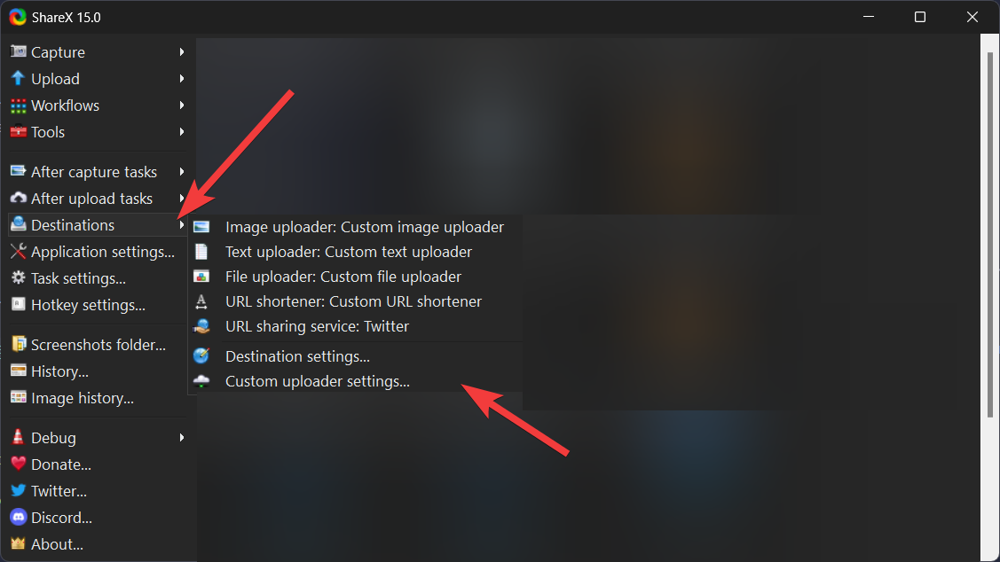
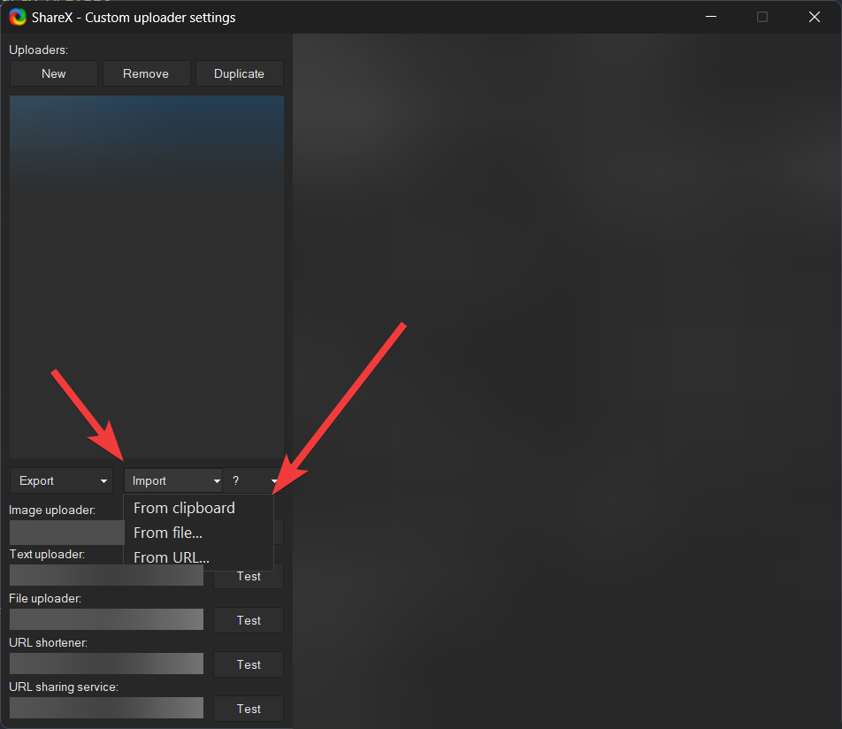
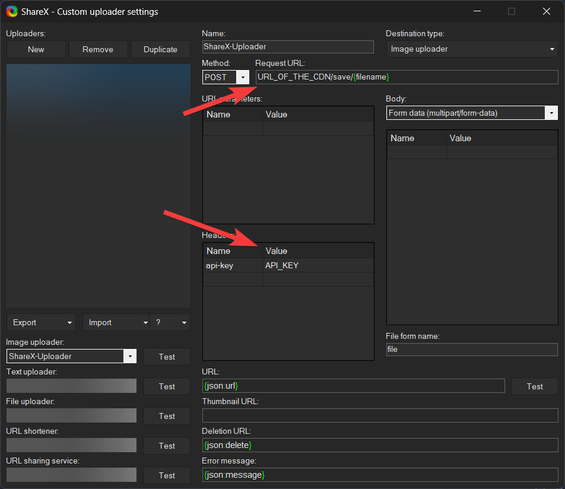
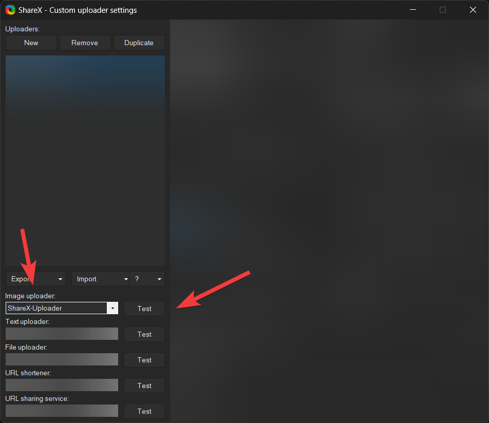

<h1 align="center">ShareX-API</h1>

<h2 align="center">API Thats designed for use with ShareX to upload your files to a web server.</h2>

This ShareX-API is designed to use the Custom Uploader feature that is build into ShareX. This API is designed to be used as a cdn for your files. The API is built using Express for the backend.

## Table of Contents

- [Prerequisites](#prerequisites)
- [Installation](#installation)
- [Setup](#setup)

## Prerequisites

In order to use this API you will need to have the following:

- A domain with dns records pointing to your server
- A server with the following installed:
  - Node.JS installed (Tested/Built with node v20.9.0)
  - Git installed
  - A process manager (optional)
  - A Reverse Proxy (optional, tested with CloudFlare Tunnels)

## Installation

1. Clone the repository to your server by running the following command:

```bash
git clone https://github.com/Kathund/ShareX-API.git
```

2. Install the dependencies by running the following command:

```bash
npm install
```

3. Setup Config by renaming the `config.example.json` to `config.json` and filling in the required information.
4. Start the API by running the following command:

```bash
npm start
```

## Setup

To setup your new ShareX API and make it work with ShareX you will need to do the following:

1. Open [ShareX](https://getsharex.com) and then on the right go to `Destinations` and then click on `Custom uploader settings`.
   
2. Copy the default config from the code block below

```json
{
  "Version": "15.0.0",
  "Name": "ShareX-Uploader",
  "DestinationType": "ImageUploader",
  "RequestMethod": "POST",
  "RequestURL": "URL_OF_THE_CDN/save/{filename}",
  "Headers": {
    "api-key": "API_KEY"
  },
  "Body": "MultipartFormData",
  "FileFormName": "files[]",
  "URL": "URL_OF_THE_CDN/{json:name}"
}
```

3. Go back to ShareX and click `Import` then select `From clipboard` and then click `OK`.
   
4. Change the `Request URL`, `URL` and the `API-KEY` to the correct values that are set in your `config.json` file.
   
5. Under `Image Uploader` in the bottom right make sure its set to `ShareX-Uploader` and then click `Test` to make sure it works.
   
